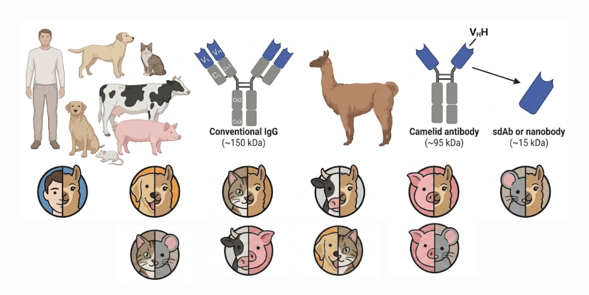

# PanIg: Pan-species Immunoglobulin Xenotypization Tool

A tool for adapting antibody and nanobody framework regions to match the sequence preferences of target veterinary species.



## Overview

PanIg is an open-source tool for **xenotypizing** and **humanizing** antibodies and nanobodies:

- **Xenotypize**: Adapt sequences to match a target veterinary species (dog, cat, horse, etc.)
- **Humanize**: Adapt sequences to match human preferences (reduce immunogenicity)

Both operations preserve CDR sequences (antigen-binding regions) and structurally important residues.

### Use Cases

- **Veterinary therapeutics**: Xenotypize human antibodies for use in dogs, cats, horses, etc.
- **Human therapeutics**: Humanize animal-derived antibodies/nanobodies for clinical use
- **Research tools**: Study species-specific antibody evolution and structure

## Features

- **Multi-species support**: Dog, cat, horse, cattle, pig, sheep, goat, rabbit, hamster
- **Both mAbs and nanobodies**: Supports conventional antibodies (VH+VL) and single-domain nanobodies (VHH)
- **Multiple numbering schemes**: IMGT, Kabat, Chothia, Martin, AHo
- **Open-source stack**: ANARCII (numbering), ImmuneBuilder (structure prediction)
- **Configurable thresholds**: Adjust species-specific frequency cutoffs
- **VHH hallmark preservation**: Nanobody-specific positions (44, 45, 47, 83, 84, 103) are locked during xenotypization

## Installation

```bash
# Clone the repository
git clone https://github.com/Lefrunila/PanIg.git
cd PanIg

# Create and activate conda environment (recommended)
conda create -n panig python=3.11 -y
conda activate panig

# Install dependencies
pip install -r requirements.txt

# Install PanIg
pip install -e .

# Install BLAST+ (required for T20 scoring)
conda install -c bioconda blast -y

# Download ImmuneBuilder model weights (required for structure prediction)
MODEL_DIR=$(python -c "import ImmuneBuilder; import os; print(os.path.join(os.path.dirname(ImmuneBuilder.__file__), 'trained_model'))")
for i in 1 2 3 4; do
    wget -q "https://zenodo.org/record/7258553/files/nanobody_model_${i}?download=1" -O "${MODEL_DIR}/nanobody_model_${i}"
    wget -q "https://zenodo.org/record/7258553/files/antibody_model_${i}?download=1" -O "${MODEL_DIR}/antibody_model_${i}"
done

# Download antibody sequence data (required for building frequency profiles)
wget -q "https://drive.google.com/uc?export=download&id=102XfRCnZYi2MsfQ22LzuYhW2M-siGQwE" -O data.tar.gz
tar -xzf data.tar.gz && rm data.tar.gz
```

### Run Tests

```bash
# Must be inside the panig conda env for all tests to pass
conda activate panig
python -m pytest tests/ -v
```

## Quick Start

### 1. Xenotypize a Sequence

```bash
# Xenotypize a nanobody to dog
panig xenotypize \
    --input my_nanobody.fasta \
    --species dog \
    --chain-type nanobody \
    --output results/

# Xenotypize a conventional antibody to cat
panig xenotypize \
    --input my_antibody.fasta \
    --species cat \
    --threshold 0.1 \
    --output results/

# Use synthetic profiles for species with sparse data (experimental)
panig xenotypize \
    --input my_antibody.fasta \
    --species cat \
    --chain-type light \
    --use-synthetic \
    --output results/
```

### 2. Humanize a Sequence

```bash
# Humanize a nanobody
panig humanize \
    --input my_nanobody.fasta \
    --chain-type nanobody \
    --output results/
```

### 3. Score Results

```bash
# Compare original vs xenotypized/humanized
panig score \
    --original results/original.fasta \
    --xenotypized results/xenotypized.fasta \
    --blastdb ~/.panig/cache/blastdb/dog_VH_blastdb
```

### 4. Predict Structure

```bash
panig predict \
    --input my_nanobody.fasta \
    --chain-type nanobody \
    --output structures/
```

### 5. Generate Synthetic Repertoire

For species with sparse data (e.g., cat, goat), generate synthetic antibody sequences from germline V(D)J recombination + somatic hypermutation:

```bash
# Generate synthetic VL repertoire for a species
python scripts/generate_synthetic_repertoire.py \
    --species cat \
    --num-seq 500 \
    --output data/synthetic/cat_VL_synthetic.fasta

# Build frequency profile from synthetic repertoire
python scripts/build_synthetic_profile.py \
    --input data/synthetic/cat_VL_synthetic.fasta \
    --output profiles/cat_VL_synthetic.json \
    --species cat
```

## Python API

```python
from panig import Xenotypizer, Numberer, SpeciesProfile

# Initialize
xenotypizer = Xenotypizer(scheme="imgt")

# Load species profile
dog_profile = SpeciesProfile.load("profiles/dog_VH.json")

# Xenotypize to dog
result = xenotypizer.xenotypize(
    sequence="QVQLVESGGGLVQAGGSLRLSCAASGRTFSSYAMGWFRQAPGKEREFVAAITWSGGNTYYADSVKGRFTISRDNAKNTVYLQMNSLKPEDTAVYYCAA...",
    target_species="dog",
    name="my_nanobody",
    chain_type="nanobody",
    species_profile=dog_profile,
)
print(f"Substitutions: {result.total_substitutions}")
print(f"Xenotypized sequence: {result.modified_sequence}")
result.to_csv("report.csv")
```

## Project Structure

```
PanIg/
├── panig/                      # Main package
│   ├── __init__.py
│   ├── cli.py                  # Command-line interface
│   ├── numbering.py            # ANARCII wrapper
│   ├── sequence.py             # NumberedSequence class
│   ├── scheme.py               # CDR/FR boundary definitions
│   ├── species_profiles.py     # Species frequency profiles
│   ├── xenotypizer.py          # Core xenotypization logic
│   ├── vhh_xenotypizer.py      # VHH-specific xenotypizer
│   ├── structure.py            # ImmuneBuilder wrapper
│   ├── interactions.py         # Protinter wrapper
│   └── scorer.py               # T20 BLAST-based scoring
├── profiles/                   # Pre-computed species profiles
├── scripts/                    # Data processing scripts
├── blastdb/                    # BLAST databases
├── tests/                      # Unit tests
├── examples/                   # Example scripts
└── requirements.txt
```

## Supported Species

| Species | VH (FR seqs) | VL | VHH |
|---------|--------------|----|-----|
| Dog     | 178 | Yes (7 seqs) | Yes (uses VH profile) |
| Cat     | 97 | Germline only | Yes (uses VH profile) |
| Horse   | 500 | Yes (479 seqs) | Yes (uses VH profile) |
| Cattle  | 156 | Yes (89 seqs) | Yes (uses VH profile) |
| Pig     | 654 | Yes (99 seqs) | Yes (uses VH profile) |
| Sheep   | 62 | Yes (26 seqs) | Yes (uses VH profile) |
| Goat    | 5 | Germline only | Yes (uses VH profile) |
| Rabbit  | 889 | Yes (11 seqs) | Yes (uses VH profile) |
| Hamster | 23 | Yes (42 seqs) | Yes (uses VH profile) |
| Human   | 200 | — | Yes (uses VH profile) |
| Alpaca  | 4449 (VHH) | — | Yes (VHH) |

**VHH profiles**: For all species except alpaca, nanobody xenotypization uses the VH profile since nanobody framework regions are similar to conventional VH.

## Benchmark

Xenotypization of a native alpaca VHH (WWV61308, *Vicugna pacos*) to each target species. CDR sequences are preserved; only framework regions are modified.

| Species | Target Species-likeness (T20) | Identity to Original | Substitutions |
|---------|------------------------------|---------------------|---------------|
| Dog | 90.27 (+9.6) | 92.4% | 9 |
| Cat | 85.88 (+5.9) | 91.5% | 10 |
| Horse | 86.71 (+27.0) | 78.0% | 26 |
| Cattle | 81.21 (+27.1) | 76.3% | 28 |
| Pig | 89.12 (+12.3) | 88.1% | 14 |
| Sheep | 82.51 (+31.2) | 72.9% | 32 |
| Goat | 88.79 (+35.6) | 72.0% | 33 |
| Rabbit | 76.59 (+11.5) | 85.6% | 17 |
| Hamster | 56.08 (+3.4) | 94.1% | 7 |

**Metrics:**
- **Target Species-likeness (T20)**: Average % identity of top 20 BLAST hits against the target species' FR-only antibody database. Higher = more native-like. Value in parentheses = improvement over original sequence.
- **Identity to Original**: Percentage of framework residues unchanged after xenotypization. Higher = more conservative.
- **Substitutions**: Number of framework positions changed.

## Known Limitations

- **Small databases for some species**: Dog VH (178 FR seqs), cat VH (97), sheep (62), goat (5), hamster (23). Results for species with small databases should be interpreted with caution.
- **Cat VL and goat VL are germline-only**: Built from IMGT germline V-gene sequences, not expressed antibodies. May produce negative improvements after xenotypization. Use `--use-synthetic` for experimental synthetic profiles.
- **Hamster scores are low**: Only 23 FR sequences available. No IMGT germlines for hamster.
- **No VH+VL paired handling**: Heavy and light chains are xenotypized independently. Interface residues are not protected from substitution.
- **VHH uses VH profiles**: For all species except alpaca, nanobody xenotypization uses the VH profile since nanobody framework regions are similar to conventional VH.

## License

MIT License - see LICENSE file for details.

## Citation

Paper forthcoming.

## Acknowledgments

- [ANARCII](https://github.com/oxpig/ANARCII) - Antibody numbering (OPIG, Oxford)
- [ImmuneBuilder](https://github.com/oxpig/ImmuneBuilder) - Structure prediction (OPIG, Oxford)
- [Llamanade](https://github.com/sangzhe/Llamanade) - Original nanobody humanization pipeline from which this work heavily inspires (deleted by original author) | [Archived copy](https://github.com/Lefrunila/Llamanade)
